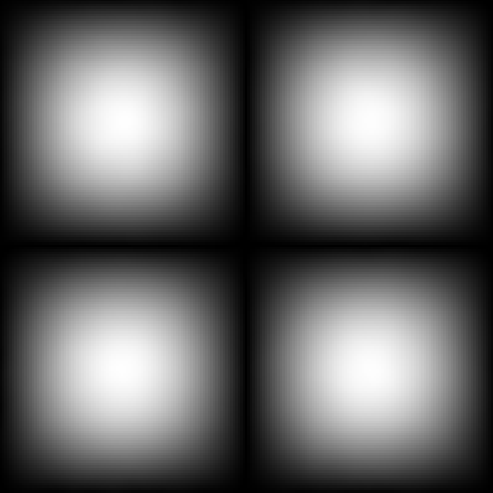
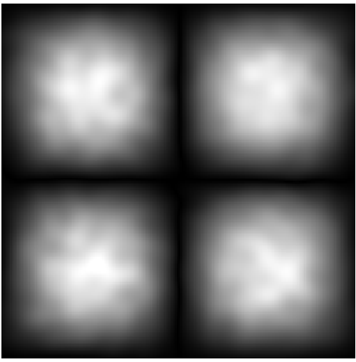
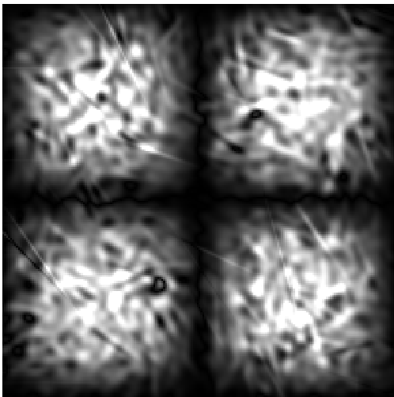
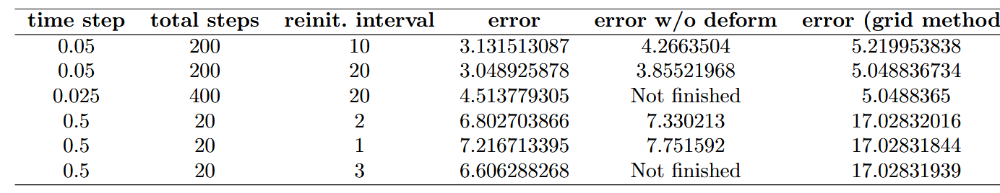
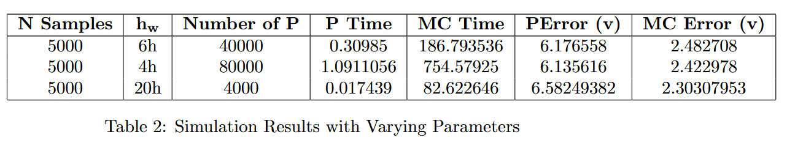

# MC Fluid Cuda

A GPU-accelerated 2D vortex-particle method that replaces the classical O(N²) Biot-Savart sum with a **Monte Carlo Multiple Importance Sampling (MIS)** estimator implemented in CUDA. The core idea is to treat velocity reconstruction as a stochastic quadrature problem and apply variance-reduction techniques borrowed from physically based rendering to fluid simulation.

---

## Physical Problem

The code solves the **2D incompressible Euler equations in vorticity-transport form**:

$$\frac{D\omega}{Dt} = 0, \qquad \mathbf{u} = \mathcal{K}[\omega], \qquad \nabla \cdot \mathbf{u} = 0$$

where the velocity–vorticity relation $\mathbf{u} = \mathcal{K}[\omega]$ is the 2D Biot-Savart operator. In Lagrangian form, each fluid parcel carries a conserved vorticity strength; the simulation advects $N$ such parcels under the velocity field they collectively induce.

- **Inviscid**: no explicit $\nu \nabla^2 \omega$ term. The flow is pure advection.
- **Periodic boundaries**: the domain $[0, L_x] \times [0, L_y]$ tiles the plane. Toggled via `SimParam::periodic`; image contributions from the $3 \times 3$ periodic tiles are included in both the vorticity evaluation and the sampling disk radius (`include/monte_carlo_bs.hpp:73`).
- **Reference case**: Taylor-Green vortex $\omega(x, y, 0) = 4\pi \sin(2\pi x)\sin(2\pi y)$ (`include/analytical_flow.hpp:24`).

---

## Vortex Element & Regularization Kernel

Particles are **regularized point vortices**: each carries a scalar strength $\omega_i$ and contributes to the continuous vorticity field through a blob kernel $W$. The induced vorticity at a point $\mathbf{x}$ is

$$\omega(\mathbf{x}) = \sum_i \omega_i \, W(|\mathbf{x} - \mathbf{x}_i|;\, h_w)$$

The kernel is a **cubic B-spline** (`include/utilities.hpp:7`):

$$W(r;\, h_w) = \frac{40}{7\pi h_w^2} \begin{cases} 6(q^3 - q^2) + 1 & 0 \le q \le \tfrac{1}{2} \\ 2(1-q)^3 & \tfrac{1}{2} < q < 1 \\ 0 & q \ge 1 \end{cases}, \qquad q = \frac{r}{h_w}$$

This kernel is $C^1$-continuous, has a compact support of radius $h_w$, and integrates to 1.

**Support radius**: `h_w = h × hwr` where `h = Lx / Nx` is the mean inter-particle spacing and `hwr` (default 16) is the overlap ratio. With `Nx = 200` and `Lx = 1`, this gives `h_w = 0.08` — each particle overlaps roughly `hwr²` neighbours, providing a smooth field reconstruction (`include/vortex_particle_mc.hpp:94`).

A hard cutoff is enforced at $r = 2 h_w$ before the kernel is evaluated (`src/cuda/monte_carlo_bs.cu:26`), so the per-particle cost of field queries is bounded independently of $N$.

---

## Velocity Reconstruction via Monte Carlo MIS

### The Integral

The 2D Biot-Savart integral at a query point $\mathbf{x}$ is:

$$\mathbf{u}(\mathbf{x}) = \frac{1}{2\pi} \int_{\mathbb{R}^2} \frac{(\mathbf{x} - \mathbf{y})^\perp}{|\mathbf{x} - \mathbf{y}|^2} \, \omega(\mathbf{y}) \, d\mathbf{y}$$

where $\mathbf{r}^\perp = (-r_y, r_x)$. The kernel $\mathbf{k}(\mathbf{x}, \mathbf{y}) = \frac{(\mathbf{x}-\mathbf{y})^\perp}{2\pi |\mathbf{x}-\mathbf{y}|^2}$ has a $1/r$ singularity and a $|\omega|$ envelope. Neither a purely vorticity-weighted sampler nor a purely distance-weighted sampler is optimal for all configurations; this motivates MIS.

### Why MIS?

A naïve Monte Carlo estimator using a single proposal $p(\mathbf{y})$ gives high variance wherever the integrand and $p$ have very different shapes:

- **Vorticity-PDF proposal** (`∝ |ω|`): excellent where vorticity is concentrated but misses the $1/r$ amplification of distant sources.
- **Disk proposal** (`∝ 1/r`, uniform over a disk): resolves the far-field $1/r$ factor but wastes samples where $|ω| \approx 0$.

Multiple Importance Sampling (Veach & Guibas 1995) combines both proposals with the **balanced heuristic**, which provably reduces variance compared to either alone.

### Two-Branch Estimator

The estimator draws $N_1 + N_2$ source locations per query particle and accumulates a weighted sum (`src/cuda/monte_carlo_bs.cu:32`, `src/cpu/monte_carlo_bs.cpp:11`):

$$\hat{\mathbf{u}}(\mathbf{x}) = \frac{1}{N_1+N_2} \sum_{j=1}^{N_1+N_2} \frac{\omega(\mathbf{y}_j) \cdot \mathbf{k}(\mathbf{x},\mathbf{y}_j)}{w_1 \, \frac{|\omega(\mathbf{y}_j)|}{\Omega} + w_2 \, \frac{\alpha}{|\mathbf{x}-\mathbf{y}_j|}}$$

where:

| Symbol | Meaning | Source |
|--------|---------|--------|
| $w_1 = N_1/(N_1+N_2)$ | weight of branch 1 | `src/cuda/monte_carlo_bs.cu:89` |
| $w_2 = N_2/(N_1+N_2)$ | weight of branch 2 | `src/cuda/monte_carlo_bs.cu:90` |
| $\Omega = \sum_i |\omega_i|$ | total vorticity mass (×9 for periodic) | `include/monte_carlo_bs.hpp:30` |
| $\alpha = 1/(2\pi R)$ | uniform disk density, $R$ = sampling radius | `src/cuda/monte_carlo_bs.cu:84` |

**Branch 1 — vorticity-PDF sampling** (`N1` samples):
1. Draw an index $i$ from the normalized discrete CDF of $\{|\omega_i|\}$ via `thrust::upper_bound` (`include/monte_carlo_bs.cuh:79`).
2. Use particle $i$'s position as the sample point $\mathbf{y}$ (particle center approximation).
3. For periodic domains, randomly displace by $(0, \pm L_x) \times (0, \pm L_y)$ to sample one of the 9 image tiles uniformly (`src/cuda/monte_carlo_bs.cu:50`).
4. Evaluate $\omega(\mathbf{y})$ via the cubic-spline kernel sum over the neighbourhood found in the spatial hash.

**Branch 2 — disk sampling** (`N2` samples):
1. Draw a point $\mathbf{y}$ uniformly over a disk of radius $R$ centred on $\mathbf{x}$: $r \sim \sqrt{U} \cdot R$, $\phi \sim 2\pi U$ (`include/monte_carlo_bs.cuh:85`). The $\sqrt{U}$ CDF inversion produces the area-uniform distribution $p(r) = r/R^2$.
2. $R$ is set to the maximum distance to any periodic image of the query point, so the disk covers the entire fundamental domain (`include/monte_carlo_bs.hpp:73`).
3. Evaluate $\omega(\mathbf{y})$ at the sampled location.

Both branches feed their sample through the same `mis_contrib` function, which applies the balanced-heuristic denominator and the Biot-Savart kernel, then accumulates into a shared running sum.

### Pre-processing: CDF Construction

Before each time step, particles are partitioned into positive ($\omega > 0$) and negative ($\omega < 0$) subsets and their normalized CDFs are built on the CPU (`src/cpu/build_particle_sets.cpp`):

```cpp
// Normalised CDF for positive particles
for (int i = 0; i < N; ++i) {
    if (omega[i] > 0) {
        sub_pos_.push_back(i);
        cum_p += omega[i];
        cdf_pos_.push_back(cum_p);     // unnormalised prefix sum
    }
}
for (float& v : cdf_pos_) v /= cum_pos_;  // normalize to [0, 1]
```

The positive and negative sets are sampled independently; the final velocity is their difference (`src/cuda/simulation_step.cu:52`):

```cuda
u[i] = vel_from_positive[i] - vel_from_negative[i];
```

This signed decomposition ensures the correct sign convention of the Biot-Savart kernel without carrying a sign flag through the inner loop.

---

## CUDA Implementation

### Per-Step Pipeline (`src/cuda/simulation_step.cu`)

```
1. Build sub-index arrays and CDFs (CPU)       build_subsets_cuda()
2. Rebuild spatial hash on GPU                 do_spatial_hashing()
3. Launch Monte Carlo BS kernel (sign=+1)      monte_carlo_bs_kernel_safe <<<N, 128>>>
4. Launch Monte Carlo BS kernel (sign=-1)      monte_carlo_bs_kernel_safe <<<N, 128>>>
5. cudaDeviceSynchronize()
6. u = vel_pos - vel_neg                       thrust::transform
7. x += u * dt                                 thrust::transform  (Euler step)
8. Wrap positions into [0, Lx) × [0, Ly)       thrust::for_each
```

### Main CUDA Kernels

**`monte_carlo_bs_kernel`** (`src/cuda/monte_carlo_bs.cu:61`)
- Launch config: one **block per particle**, `TPB = 128` threads per block.
- Threads within a block cooperate to draw `N1 + N2` samples in parallel (`t = threadIdx.x; t < N1+N2; t += blockDim.x`).
- Uses `__shared__ float2 ssum` for intra-block accumulation: each thread writes its partial contribution via `atomicAdd` to shared memory, avoiding costly global atomics for most of the work.
- A final `cooperative_groups::sync()` barrier ensures all threads have written before the block leader copies `ssum` to global output.

**`monte_carlo_bs_kernel_safe`** (`src/cuda/monte_carlo_bs.cu:141`)
- Same estimator, but accumulates into a thread-local `float2 local_acc` and uses a single `atomicAdd` to global memory at the end.
- Used as the default in `step_cuda` — more portable across GPU architectures.

**`matvec_kernel`** (`src/cuda/cg_rbf_init.cu:11`)
- Standard flat grid: `(N + 255) / 256` blocks × 256 threads.
- Computes $y_i = \sum_j x_j W(|\mathbf{x}_i - \mathbf{x}_j|; h_w)$ — the RBF operator applied to a vector, used inside the CG loop.

**`FillCells_kernel` / `counting_sort_kernel`** (`src/cuda/hash.cu`)
- Build a uniform spatial hash grid to accelerate neighbour queries during vorticity evaluation.
- Grid resolution: `rsh = Nx / hwr / 4` (one cell per ~4 support radii).
- Details in the [Spatial Hash](#spatial-hash) section below.

### Memory Layout

Particle data lives in separate `dvec<T>` (Thrust device vectors) — effectively **Structure-of-Arrays**:

```
dvec<float2>  pos, vel          // position, velocity
dvec<float>   omega             // vorticity strength
dvec<float>   omega_field       // target field (used during CG init)
dvec<int>     sub_pos_, sub_neg_ // index subsets by sign
dvec<float>   cdf_pos_, cdf_neg_ // importance-sampling CDFs
```

`VorticityView` is a lightweight device-side descriptor (raw pointer + grid metadata) passed by value to kernels, avoiding global memory indirection (`include/vortex_particle_mc.hpp:73`).

### Random Number Generation

Each thread holds an independent `curandStatePhilox4_32_10_t` state, seeded by `(particle_id, thread_lane)`. The Philox counter-based generator is ideal here: it is stateless between kernel launches, requires no global state array, and produces high-quality independent streams per thread.

---

## Spatial Hash

Every vorticity evaluation — inside the MIS kernel, inside `matvec_kernel`, and during CG initialization — needs to find all particles within the support radius $h_w$ of a query point. A brute-force linear scan over all $N$ particles would dominate runtime. Instead the code maintains a **uniform grid spatial hash** that reduces the neighbour search to a fixed 3×3 = 9 cell lookup.

### Data Layout (`include/spatial_hash.hpp`)

The grid has `rshx × rshy` cells uniformly covering the domain $[0, L_x] \times [0, L_y]$. Four device arrays describe it:

| Array | Size | Content |
|-------|------|---------|
| `cell_num` | `rshx × rshy` | number of particles in each cell |
| `cell_acc` | `rshx × rshy` | exclusive prefix sum of `cell_num` (start offset of each cell in sorted order) |
| `vp_cell` | `N` | which cell index particle `i` maps to |
| `vp_sort` | `N` | particle local indices in cell-sorted order |

Separate hash structures are maintained for positive particles, negative particles, and the full set, because the MIS and CG kernels query them independently.

### Build Phase (two GPU kernels, `src/cuda/hash.cu`)

**Step 1 — `FillCells_kernel`** (flat grid, 256 threads/block):

```cuda
int ix = int(floorf(pos.x * inv_hx));   // inv_hx = rshx / Lx
int iy = int(floorf(pos.y * inv_hy));
int cell = ix * rshy + iy;
vp_cell[i] = cell;
atomicAdd(cell_num + cell, 1);          // histogram via global atomic
```

Each thread handles one particle. The `atomicAdd` histogram is a classic GPU pattern: all $N$ threads run concurrently, and only the histogram counters — not the particle data — require synchronisation. For $N = 6000$ particles the kernel occupies a single wave of blocks and completes in a handful of microseconds.

**Step 2 — prefix sum** (Thrust):

```cuda
thrust::exclusive_scan(thrust::device,
    d_cell_num, d_cell_num + cell_cnt, d_cell_acc);
```

This produces `cell_acc[c]` = the index in `vp_sort` where cell `c` begins — a standard compaction pattern executed by CUB's segmented scan internally.

**Step 3 — `counting_sort_kernel`** (flat grid, 256 threads/block):

```cuda
// Iterates particles in reverse order for stable placement
int dst = atomicSub(cell_num + c, 1) - 1 + cell_acc[c];
vp_map[dst] = i;
```

`cell_num` is reused as a per-cell decrementing counter. Each thread claims the next free slot in its cell's range via `atomicSub`, then writes the particle's local index. Processing in reverse order with `atomicSub` produces a stable sort within each cell. After this step `vp_sort` holds particle indices grouped by cell, and `cell_acc` gives the start of each group.

### Query Phase (`include/vorticity_query.cuh:16`)

At query time, only the **3×3 neighbourhood** of the cell containing the query point is visited:

```cuda
int cx = int(p.x / Lx * rshx);   // cell of query point
int cy = int(p.y / Ly * rshy);
for (int ox = -1; ox <= 1; ++ox)
    for (int oy = -1; oy <= 1; ++oy) {
        // wrap cell index for periodic BC
        int c   = gx * rshy + gy;
        int beg = cell_acc[c];
        int end = cell_acc[c + 1];          // exclusive
        for (int k = beg; k < end; ++k) {
            int I = sub[vp_sort[k]];        // global particle index
            // distance check + kernel eval
        }
    }
```

This limits neighbour candidates to at most `9 × (N / (rshx × rshy))` particles instead of $N$. The actual distance check `r² > h_w²` then culls particles outside the circular support.

### Choosing Grid Resolution

Grid resolution is set to `rsh = Nx / hwr / 4` (`apps/vortex_method_mc.cu:36`). With default `Nx = 200`, `hwr = 16`, this gives `rsh = 3` — a 3×3 grid covering the unit domain. Each cell spans roughly `4 h_w` in each direction, so the 3×3 neighbourhood query safely covers a circle of radius `h_w` without missing any particle.

This choice reflects a fundamental trade-off:

| `rsh` too small (few large cells) | `rsh` too large (many small cells) |
|-----------------------------------|-------------------------------------|
| Each cell holds many particles → neighbour list is long → more distance checks per query | Cells are smaller than `h_w` → need a wider stencil than 3×3 to cover the support |
| Slow `queryVorticityAbs` inner loop | Stencil must grow; code assumes 3×3 is sufficient |
| Low `cell_num`/`cell_acc` memory | Larger grid arrays; more prefix-sum work |

The invariant to maintain is:

$$\frac{L_x}{\text{rshx}} \;\geq\; h_w \quad \Leftrightarrow \quad \text{rshx} \;\leq\; \frac{L_x}{h_w} = \frac{N_x}{\text{hwr}}$$

With the default formula `rsh = Nx / hwr / 4` this is satisfied with a factor-of-4 safety margin — the cell side is `4 h_w`, so the 3×3 stencil covers `±1 cell = ±4 h_w` in each direction, well beyond the `h_w` support radius.

**Tuning for performance**: if $N$ is large and particles are nearly uniformly distributed, increasing `rsh` toward `Nx / hwr` reduces the average neighbour list length proportionally, speeding up both the MIS vorticity evaluations and the CG matrix-vector product. The cost is a larger grid array and a slightly longer prefix-sum pass — typically negligible for `rsh² ≪ N`.

---

## Initialization: RBF Conjugate Gradient

Given a target continuous vorticity field $\omega_\text{target}(\mathbf{x})$, particle strengths $\{\omega_i\}$ are found by solving the least-squares system:

$$\min_{\{\omega_i\}} \left\| \sum_i \omega_i \, W(|\mathbf{x} - \mathbf{x}_i|;\, h_w) - \omega_\text{target}(\mathbf{x}) \right\|^2$$

evaluated at the particle locations themselves. This becomes a symmetric positive-definite linear system $\mathbf{A}\boldsymbol{\omega} = \mathbf{b}$ where $A_{ij} = W(|\mathbf{x}_i - \mathbf{x}_j|; h_w)$ and $b_i = \omega_\text{target}(\mathbf{x}_i)$.

The system is solved with **conjugate gradient** entirely on the GPU (`src/cuda/cg_rbf_init.cu:53`):

- Matrix-vector product `Ax_cuda` launches `matvec_kernel` — no matrix is ever formed explicitly; the product is evaluated via the spatial hash.
- Dot products and vector updates use `thrust::inner_product` and `thrust::transform` with device lambdas.
- Convergence criterion: $\|\mathbf{r}\|_2 / \|\mathbf{b}\|_2 < 5 \times 10^{-3}$, up to 1000 iterations.
- Diagonal preconditioner: initial guess $\omega_i^{(0)} = b_i / W(0; h_w)$, which corresponds to scaling by the self-influence of each particle.

---

## Time Integration

**Forward Euler** (first-order explicit):

$$\mathbf{x}_i^{n+1} = \mathbf{x}_i^n + \Delta t \, \mathbf{u}(\mathbf{x}_i^n)$$

Implemented as a single `thrust::transform` fused with periodic wrapping (`src/cuda/simulation_step.cu:59`). Default $\Delta t = 0.01$.

The method is first-order accurate in time and conditionally stable. The stability constraint is the CFL condition $\Delta t \lesssim h / \|\mathbf{u}\|_\infty$. No adaptive time-stepping is implemented.

---

## Kernel Deformation

A static blob kernel advected purely by particle position loses accuracy as the flow stretches and shears the local vorticity distribution. To address this, each particle carries a **deformation Jacobian** $J(t) \in \mathbb{R}^{2 \times 2}$ that tracks how its kernel shape evolves with the flow.

### Jacobian-Deformed Kernel

When evaluating the vorticity contributed by particle $p$ at a field point $\mathbf{x}$, the isotropic distance $r = |\mathbf{x} - \mathbf{x}_p|$ is replaced by an anisotropic Mahalanobis distance:

$$r_J = \left\| J^{-1}(t)\,(\mathbf{x} - \mathbf{x}_p(t)) \right\|$$

so that the kernel $W(r_J; h_w)$ is evaluated in the deformed frame. This is a first-order Taylor approximation of the exact pullback of the kernel through the flow map $\Phi$.

### Numerical Jacobian via Auxiliary Local Frame

Rather than integrating the Jacobian ODE $dJ/dt = \nabla \mathbf{u} \cdot J$ analytically (which introduces independent numerical errors), the code tracks **4 auxiliary particles** per vortex particle — stored in `pos_left`, `pos_right`, `pos_top`, `pos_bottom` (`include/vortex_particle_mc.hpp:23`) — placed at distance $\delta x$ along each axis. All 5 points are advected by the same MC Biot-Savart velocity and the same forward Euler step. The numerical Jacobian at step $n$ is then estimated by finite differences:

$$J_n = \left[\frac{\hat{c}_2 - \hat{c}_1}{2\delta x} \;\Bigg|\; \frac{\hat{c}_4 - \hat{c}_3}{2\delta x}\right]$$

where $\hat{c}_1, \hat{c}_2$ are the left/right auxiliary positions and $\hat{c}_3, \hat{c}_4$ are the top/bottom positions after advection. The Jacobian is then **volume-normalized** to enforce incompressibility:

$$J_\text{norm} = \frac{1}{\det(J)^{1/d}} J$$

This approach, inspired by the Incompressible Particle-In-Cell (IPIC) method, captures the true numerical deformation of the discretised flow map rather than the analytic one, keeping the two consistent.

### Sample Reuse for Jacobian Stability

A key challenge is that the velocity gradient $\nabla \mathbf{u}$ needed to deform the kernel is evaluated by the same noisy MC estimator used for advection. When finite-differencing the velocity between a particle and its auxiliary points, independent Monte Carlo noise on each evaluation introduces large variance in the Jacobian. The solution is **sample reuse**: the $N_1$ source-particle samples drawn for the central particle are shared with all 4 auxiliary particles. Since nearby points see nearly identical source distributions, reusing samples dramatically reduces the differential noise and stabilises the Jacobian even at modest $N_1 + N_2$.

### Reinitialization

Kernel deformation cannot proceed indefinitely — as the Jacobian accumulates stretch, two problems arise: (1) the deformed support radius may exceed the spatial hash cell size, invalidating neighbour queries; (2) extreme aspect ratios cause the kernel to become effectively zero almost everywhere, starving the vorticity field of coverage. A **periodic reinitialization** resets all particle positions to a new uniform grid, sets all Jacobians to $I$, and solves the RBF-CG system again to re-fit vorticity strengths. The reinitialization interval is a key hyperparameter (see Table 1 in the Results section below).

---

## Key Hyperparameters

All parameters live in `SimParam` (`include/vortex_particle_mc.hpp:91`). Understanding their interactions is essential for balancing accuracy, variance, and runtime.

### Particle Resolution: `Nx` and `N_max`

`Nx` (default 200) sets the nominal grid resolution from which the inter-particle spacing is derived: `h = Lx / Nx`. `N_max` (default 6000) is the actual particle count. These should be consistent — with `Lx = Ly = 1` a `200 × 200` grid has 40,000 lattice sites, so `N_max = 6000` means roughly one particle per 6–7 grid cells. Making `N_max` closer to `Nx²` improves the RBF initialization accuracy but increases both memory and the cost of the CDF construction step.

### Kernel Support Radius: `hwr`

`hwr` (default 16) is the ratio `h_w / h`. It controls how many particles each blob kernel reaches.

- **Too small** (`hwr < 4`): neighbouring particle blobs barely overlap, the reconstructed vorticity field is noisy, and the CG initialization converges poorly.
- **Too large** (`hwr > 32`): each vorticity query visits a large neighbourhood, slowing down both MIS inner loops and the CG matrix-vector product. It also over-smooths the initial condition.
- The hard cutoff at `2 h_w` means the actual support is `2 × hwr` particle spacings. At `hwr = 16` each particle interacts with roughly `π(2×16)² ≈ 3200` others in a dense uniform field — expensive per query but bounded.
- **Effect on spatial hash**: `rsh = Nx / hwr / 4`, so larger `hwr` reduces `rsh` and makes hash cells coarser. If `hwr` is increased, `rsh` should be re-examined to avoid cells becoming so large that the neighbour list overwhelms the savings from hashing.

### MIS Sample Counts: `N1` and `N2`

`N1` and `N2` (both default 1000) are the number of samples drawn from each branch of the MIS estimator per particle per step.

- The velocity estimator is **unbiased** for any `N1, N2 > 0`; these parameters only control the variance (and therefore the effective noise in the advection step).
- Increasing `N1 + N2` reduces variance as $1/\sqrt{N_1 + N_2}$, at linear cost in GPU time — each sample adds one vorticity evaluation (a spatial-hash query) plus the balanced-heuristic weight computation.
- The **split between N1 and N2** matters. In flows where vorticity is tightly concentrated (e.g., isolated vortices), branch 1 (vorticity-PDF) is highly efficient and `N1 ≫ N2` is optimal. In diffuse vorticity fields branch 2 (disk sampling) does more work. The balanced heuristic automatically adjusts the per-sample weight, so an equal split `N1 = N2` is a safe default.
- Each block in `monte_carlo_bs_kernel_safe` processes `N1 + N2` iterations with `TPB = 128` threads, so the work per block is `ceil((N1 + N2) / 128)` iterations per thread. If `N1 + N2 < 128`, threads are under-utilized; values above 128 amortize the kernel launch overhead better.

### Time Step: `dt`

`dt` (default 0.01) must satisfy the CFL condition $\Delta t \lesssim h / \|\mathbf{u}\|_\infty$. With `h = 0.005` and typical vortex velocities $O(1)$ this allows `dt ≈ 0.005`. The default is at the margin; flows with strong vorticity concentration may require smaller values.

### Parameter Interaction Summary

| Goal | Recommended change |
|------|--------------------|
| Reduce velocity noise (smoother trajectories) | Increase `N1 + N2`; keep `N1 ≈ N2` for mixed flows |
| Faster per-step runtime | Reduce `N1 + N2`; accept higher stochastic noise |
| Better initial condition fidelity | Increase `N_max` toward `Nx²`; lower `hwr` to reduce over-smoothing |
| Improve neighbour-query throughput | Increase `rsh` up to `Nx / hwr`; verify 3×3 stencil still covers `h_w` |
| Higher spatial resolution | Increase `Nx` (adjusts `h`, `h_w`, `rsh` together); scale `N_max` accordingly |

---

## Overall Algorithm

The full per-step pipeline combines initialization, Lagrangian advection, kernel deformation, and periodic reinitialization:

```
───────────────────────────── INITIALIZATION (once) ─────────────────────────
1.  Place N particles on a uniform grid over [0,Lx]×[0,Ly].
2.  Set omega_field[i] = omega_target(x_i)   (e.g. Taylor-Green)
3.  Build CDF/iCDF tables for cubic-spline kernel (used by branch-1 sampler)
4.  Solve RBF-CG:  A * omega = omega_field    (GPU conjugate gradient)
    → assigns particle strengths {omega_i} that reconstruct the target field
5.  Partition into sub_pos / sub_neg; build normalized CDFs for MIS branch 1
6.  Build spatial hash (FillCells + prefix scan + counting sort)
7.  For each particle, place 4 auxiliary points at ±delta_x along each axis
    (stored in pos_left, pos_right, pos_top, pos_bottom)

──────────────────────────── SIMULATION LOOP (each step n) ──────────────────
8.  MC Biot-Savart  (positive contribution)
      monte_carlo_bs_kernel_safe <<<N, 128>>> (sign = +1)
      → for each particle i, draw N1 samples from CDF of |omega_pos|
           and N2 samples uniformly from disk, apply MIS balanced heuristic
           → accumulate vel_pos[i]

9.  MC Biot-Savart  (negative contribution)
      monte_carlo_bs_kernel_safe <<<N, 128>>> (sign = -1)
      → same, using neg subset  →  vel_neg[i]

10. Compute net velocity:   u[i] = vel_pos[i] - vel_neg[i]       (thrust)

11. Forward Euler advection of ALL points (particles + auxiliaries):
      x[i]     += u(x[i])     * dt
      c1[i]    += u(c1[i])    * dt       (left  auxiliary)
      c2[i]    += u(c2[i])    * dt       (right auxiliary)
      c3[i]    += u(c3[i])    * dt       (top   auxiliary)
      c4[i]    += u(c4[i])    * dt       (bottom auxiliary)
    velocities for auxiliaries are evaluated by the same MC estimator
    with N1 samples *reused* from the central particle (sample reuse)

12. Compute deformation Jacobian from auxiliary displacements:
      J = [ (c2-c1)/(2*delta_x)  |  (c4-c3)/(2*delta_x) ]
    Normalize for incompressibility:  J_norm = J / det(J)^(1/d)
    Store J_norm[i] in jac[i]

13. Apply periodic wrapping to all positions                      (thrust)

14. Rebuild spatial hash                          (FillCells + CountingSort)

15. Rebuild sub_pos / sub_neg CDFs                (build_subsets_cuda)

──────────────────── REINITIALIZATION (every K steps) ───────────────────────
16. Reset all particle positions to uniform grid
    Reset all Jacobians to identity
    Re-solve RBF-CG to re-fit {omega_i} to the current vorticity field
    Rebuild spatial hash and CDFs
```

Note: step 11's auxiliary-particle velocities share the same $N_1$ source samples as the central particle (sample reuse), so the finite-difference Jacobian is computed from correlated rather than independent MC draws — dramatically reducing Jacobian variance without additional kernel evaluations.

---

## Experimental Results

All experiments use Taylor-Green vortex $\omega_0(x,y) = 2\sin(2\pi x)\sin(2\pi y)$ on a periodic unit domain. Errors are $L^2$ norms of the vorticity field against ground truth.

---

### Fig. 1 — Initial reconstruction (t = 0)



The four-quadrant layout reflects the $2\times 2$ periodic tiling of the unit domain. Each quadrant shows a smooth, rotationally symmetric vorticity peak — the hallmark of the Taylor-Green initial condition. The clean result confirms that the RBF-CG solver converges to a faithful representation: particle strengths $\{\omega_i\}$ accurately reconstruct the target field, with no ringing or ghost features near cell boundaries.

---

### Fig. 2 — MC evolution with kernel deformation (dt = 0.05, several steps)



After several time steps with deformation enabled, the four blobs develop internal structure: vortex filaments, roll-up features, and small-scale braiding consistent with 2D Euler dynamics. Fine-grained MC noise (from the stochastic velocity estimator) is visible as texture, but the large-scale vorticity topology is preserved and the four quadrants remain mutually consistent across periodic boundaries.

---

### Fig. 3 — Unstable deformation (dt = 0.5, no reinitialization bound)



Without a bounded reinitialization interval, or when $\Delta t$ is too large, the Jacobian accumulates numerical error faster than the MC estimator can resolve $\nabla \mathbf{u}$. Kernels become highly elongated, vorticity leaks across hash cells, and spatial hashing is no longer valid. The field collapses into high-frequency noise with no physical structure. Crucially, increasing $N_1 = N_2$ from 500 to 5000 does **not** cure this — the instability is in the Jacobian ODE discretisation, not in the Monte Carlo variance.

---

### Table 1 — Effect of Deformation and Reinitialization Interval

Three methods compared: **MC + deform** (this work), **MC w/o deform** (static blob kernels), **grid method** (O(N²) Eulerian Biot-Savart). Errors are accumulated $L^2$ vorticity error over the full run.



**Observations:**
- MC + deform is the best method at **every** setting — gains of 25–40% over static-kernel MC, and 35–65% over the grid method.
- For small $\Delta t = 0.05$, a longer reinit interval (20 steps) is slightly better than 10 — the Jacobian has not yet diverged and each reset discards useful deformation information.
- At large $\Delta t = 0.5$, reinit interval 3 gives the best result; interval 1 (reset every step) degrades toward the static-kernel baseline because no deformation information accumulates across steps.
- The grid method is far more sensitive to $\Delta t$: error grows from 5.0 to 17.0 as $\Delta t$ increases from 0.05 to 0.5. MC + deform degrades from 3.1 to 6.8 over the same range — roughly half the sensitivity.

---

### Table 2 — MC vs. Pure Particle Method: Accuracy and Runtime

Fixed $N_1 = N_2 = 5000$. **P** = pure particle method (deterministic, static kernels); **MC** = this method with MIS. Error metric is $L^2$ velocity error.



**Observations:**
- MC reduces velocity error by **~60%** relative to the pure particle method across all three configurations — a robust accuracy advantage regardless of $h_w$ or particle count.
- Runtime cost: MC is 2–3 orders of magnitude slower at fixed $N_1 + N_2 = 10000$. Profiling shows `EvaluateVorticityAbs` (the spatial-hash neighbour query called once per MC sample) accounts for the dominant fraction of MC time.
- Increasing particle count from 4K ($h_w = 20h$) to 40K ($h_w = 6h$) with the same number of samples increases MC time by ~2.3× — sub-linear in $N$, consistent with the spatial hash reducing the per-query cost.
- The $h_w = 20h$ / 4K particle configuration achieves the **lowest MC error** (2.303) at the **lowest MC runtime** (82.6s), suggesting that fewer particles with a larger kernel is the favourable regime for the MIS estimator: the smoother vorticity field is better captured by the vorticity-PDF branch, reducing estimator variance.

---

## Project Structure

```
apps/
  vortex_method_mc.cu         Main simulation driver; PNG + SVG output each step
  test_spatial_hashing.cu     Unit driver for hash kernels (CPU & CUDA backends)
bindings/
  phash.cpp                   pybind11 module exposing the spatial hash
include/
  vortex_particle_mc.hpp      SimParam, ParticleSet, Simulation class
  monte_carlo_bs.hpp / .cuh   Biot-Savart kernel, MIS helpers, device samplers
  utilities.hpp               Cubic B-spline kernel W(r; h_w)
  analytical_flow.hpp         Taylor-Green reference solution
  spatial_hash.hpp            Uniform hash-grid data structure
src/
  cuda/monte_carlo_bs.cu      monte_carlo_bs_kernel, monte_carlo_bs_kernel_safe
  cuda/simulation_step.cu     step_cuda: full per-step pipeline
  cuda/cg_rbf_init.cu         RBF conjugate gradient initialization
  cpu/monte_carlo_bs.cpp      CPU reference implementation of the MIS estimator
  cpu/build_particle_sets.cpp CDF construction, positive/negative subset split
tests/
  smoke.py                    Import smoke test for the phash Python binding
```

---

## Dependencies

| Library | Role |
|---------|------|
| **CUDA Toolkit ≥ 12** | CUDA runtime, cuRAND (`curandStatePhilox4_32_10_t`) |
| **Thrust / CCCL** (local, `deps/cccl/`) | Device vectors, `transform`, `inner_product`, `upper_bound` |
| **pybind11** | Python binding for the spatial hash module |
| **OpenMP** (optional) | CPU-parallel hash backend (`lib/CMakeLists.txt:32`) |
| **stb_image_write** (header-only) | PNG export of per-step vorticity snapshots |

No FFTW, Eigen, or cuBLAS. Requires CMake ≥ 3.22 and a C++20 compiler.

---

## Build & Run

```bash
cmake -B build -DCMAKE_BUILD_TYPE=Release
cmake --build build --parallel

# Run the main simulation (outputs result/step_NNNN.png and result/vel/vel_step_NNNN.svg)
./build/vortex_method_mc

# Run the spatial hash unit test
./build/test_spatial_hashing
```
